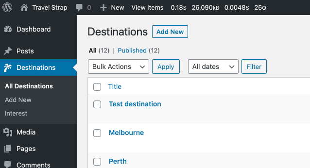
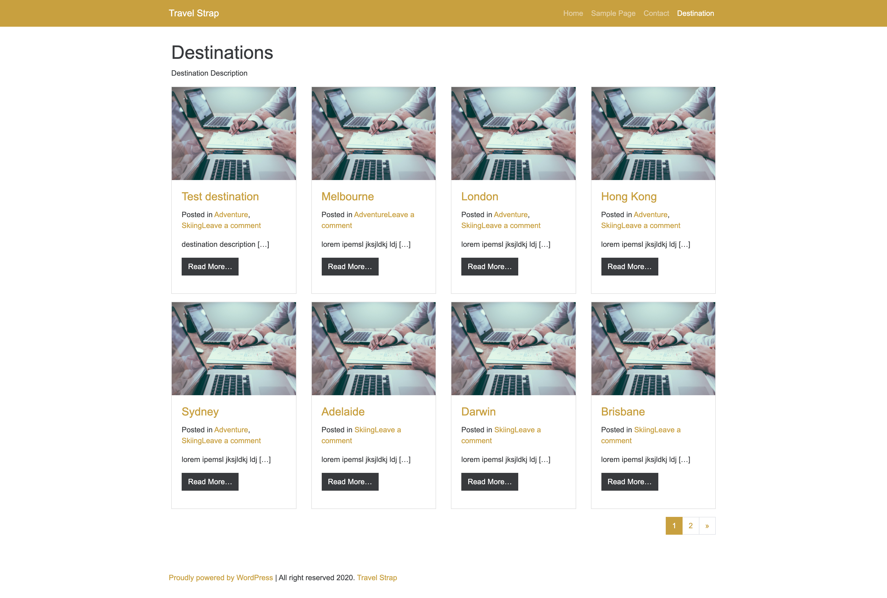
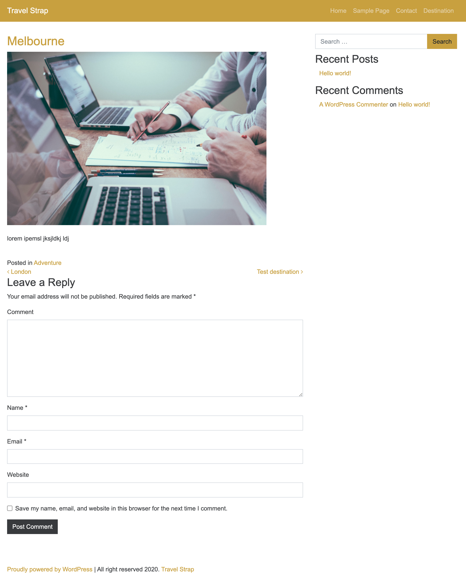

# WP Travel

WordPress theme based on Bootstrap, Understrap and _S

## License

http://www.gnu.org/licenses/old-licenses/gpl-2.0.en.html

## Changelog
See [changelog](CHANGELOG.md)


## Basic Features

- Combines Underscore’s PHP/JS files and Bootstrap’s HTML/CSS/JS.
- Comes with Bootstrap (v4) Sass source files and additional .scss files. Nicely sorted and ready to add your own variables and customize the Bootstrap variables.
- Uses a single minified CSS file for all the basic stuff.
- [Font Awesome](http://fortawesome.github.io/Font-Awesome/) integration (v4.7.0)
- Jetpack ready.
- WooCommerce support.
- Contact Form 7 support.
- Child theme support
- Translation ready.

## Styling

- The theme itself uses the `/style.css`file only to identify the theme inside of WordPress. The file is not loaded by the theme and does not include any styles.
- The `/css/theme.css` and its minified little brother `/css/theme.min.css` file(s) provides all styles. It is composed of five different SCSS sets and one variable file at `/sass/theme.scss`:


- Style code goes into: `/sass/theme`.
  - `/sass/theme/_theme.scss` theme style file
  - Variables to the `/sass/theme/_theme_variables.scss`
  - Or add other .scss files into it and `@import` it into `/sass/theme/_theme.scss`.

## Installation

### Classic install
- Download it from GitHub make sure you rename the `wp-travel-master.zip` file just to `wp-travel.zip`
- Upload it into your WordPress installation theme subfolder: `/wp-content/themes/`
- Login to your WordPress backend
- Go to Appearance → Themes
- Activate the UnderStrap theme


## Developing With npm, Gulp and SASS and [Browser Sync][1]

### Installing Dependencies
- Make sure you have installed Node.js and Browser-Sync (optional) on your computer globally
- Then open your terminal and browse to the location of your UnderStrap copy
- Run: `$ npm install`

### Running
To work with and compile your Sass files on the fly start:

- `$ gulp watch`

Or, to run with Browser-Sync:

- First change the browser-sync options to reflect your environment in the file `/gulpconfig.json` in the beginning of the file:
```javascript
{
    "browserSyncOptions" : {
        "proxy": "localhost/wp/", // <----- CHANGE HERE
        "notify": false
    },
    ...
};
```
- then run: `$ gulp watch-bs`

## How to Use the Built-In Widget Slider

The front-page slider is widget driven. Simply add more than one widget to widget position “Hero”.
- Click on Appearance → Widgets.
- Add two, or more, widgets of any kind to widget area “Hero”.
- That’s it.


## Page Templates
WP Travel includes several different page template files:

### Blank Template

The `blank.php` template is useful when working with various page builders and can be used as a starting blank canvas.

### Empty Template

The `empty.php` template displays a header and a footer only. A good starting point for landing pages.

### Full Width Template

The `fullwidthpage.php` template has full width layout without a sidebar.

### Destination CPT Template

The archive page `archive-destination.php` and single page `single-destination.php`

### Interest Custom Taxonomy Template

The taxonomy page `taxonomy-interest.php`

### Home Page Template 

The `homepage.php` template to display custom home page with `destination` gird.

### Admin Demo

<p align="center">
  
</p>

### Destination Grid

<p align="center">
  
</p>


### Single Destination

<p align="center">
  
</p>

## Footnotes

[1] Visit [http://browsersync.io](http://browsersync.io) for more information on Browser Sync

Licenses & Credits
=
- Font Awesome: http://fontawesome.io/license (Font: SIL OFL 1.1, CSS: MIT License)
- Bootstrap: http://getbootstrap.com | https://github.com/twbs/bootstrap/blob/master/LICENSE (Code licensed under MIT documentation under CC BY 3.0.)
and of course
- jQuery: https://jquery.org | (Code licensed under MIT)
- WP Bootstrap Navwalker by Edward McIntyre: https://github.com/twittem/wp-bootstrap-navwalker | GNU GPL
- Bootstrap Gallery Script based on Roots Sage Gallery: https://github.com/roots/sage/blob/5b9786b8ceecfe717db55666efe5bcf0c9e1801c/lib/gallery.php
